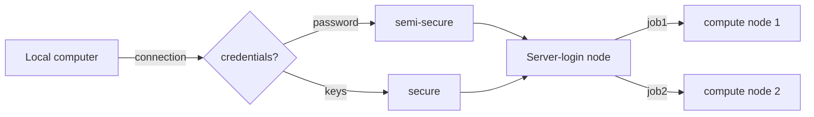

### Chapter 2

# Remote actions

Here, you will learn how to interact with remote computers, transfer files and send jobs to a cluster.

How fast will your jobs schedule depends on two main factors:

- The requested resources vs available resources
- According to your **Fairshare** score:
  - number of jobs/resources requested in the past
  - precision of the resources requested vs needed
  
## Summary

- Data transfer
  - `sshfs` to access remote folders on your computer
  - `rsync` to transfer files efficiently
- Cluster usage
  - `srun` for interactive or on the spot Jobs
  - `sbatch` for submitting jobs that will run at a later time
 - Basic cluster flags
  - `-N X` to ask for maximum amount of machines/nodes (each node has multiple cores)
  - `-c X` to ask for maximum amount of cores 
  - `--mem Y` to ask for the maximum amount of memory your job will requre, in **Mb** (2000 is 2GB)
  - `--time=d-hh:mm:00` to ask for the maximum amount of time that your job will require
